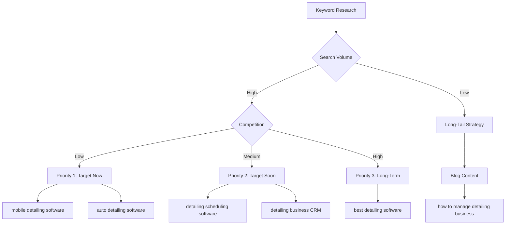

# Mobile Detailing Management App - Keyword Strategy

## Executive Summary
This document outlines a strategic keyword optimization plan for a mobile detailing management app landing page. Keywords are organized by priority, search intent, and implementation location.

---

## Tier 1: Primary Target Keywords (Highest Priority)

These keywords should be prominently featured in H1, title tags, and hero sections.

### Core Software Keywords
| Keyword | Search Intent | Priority | Implementation |
|---------|--------------|----------|----------------|
| mobile detailing software | Commercial - High Intent | 🔴 Critical | H1, Title Tag, Hero |
| auto detailing software | Commercial - High Intent | 🔴 Critical | H1 variation, Meta |
| detailing business software | Commercial - High Intent | 🔴 Critical | H2, Body Content |
| car detailing app | Commercial - High Intent | 🟡 High | Feature Section |
| mobile detailing app | Commercial - High Intent | 🟡 High | Feature Section |
| detailing management software | Commercial - High Intent | 🟡 High | H2, Navigation |

### Scheduling & Booking Keywords
| Keyword | Search Intent | Priority | Implementation |
|---------|--------------|----------|----------------|
| detailing scheduling software | Feature-Specific | 🟡 High | Feature Page H1 |
| auto detailing appointment software | Feature-Specific | 🟡 High | Feature Section |
| mobile detailing booking software | Feature-Specific | 🟡 High | Feature Section |
| car detailing scheduling app | Feature-Specific | 🟢 Medium | Body Content |
| online booking for detailers | Feature-Specific | 🟢 Medium | Feature Description |

---

## Tier 2: Secondary Keywords (Feature-Specific)

Target these in dedicated feature sections and subpages.

### Business Management Features
| Keyword | Target Section | Content Type |
|---------|---------------|--------------|
| detailing business CRM | CRM Feature Section | Feature Page |
| auto detailing invoicing software | Invoicing Feature | Feature Page |
| mobile detailing payment processing | Payment Feature | Feature Page |
| detailing customer management | CRM Section | Body Content |
| car detailing quote software | Quoting Feature | Feature Page |
| detailing estimating software | Estimating Feature | Feature Page |
| auto detailing POS system | Payment Section | Feature Page |

### Mobile/Field Service Keywords
| Keyword | Target Section | Content Type |
|---------|---------------|--------------|
| mobile auto detailing management | Hero/Overview | Homepage |
| on-site detailing software | Mobile Features | Feature Section |
| field service detailing app | Mobile Features | Feature Section |
| mobile detailing route optimization | Route Feature | Feature Page |
| GPS tracking for detailers | Tracking Feature | Feature Page |

---

## Tier 3: Long-Tail Keywords (Content & Blog)

Use these for blog posts, FAQ sections, and supporting content.

### Question-Based Keywords
- "best software for mobile detailing business"
- "how to manage mobile detailing business"
- "what is the best detailing business software"
- "how to automate detailing business"

### Solution-Focused Keywords
- detailing business scheduling app
- mobile detailing invoice app
- auto detailing CRM for small business
- detailing software with payment processing
- mobile detailing business management tools
- detailing app with online booking
- software for mobile car wash business
- detailing business appointment reminders

### Problem-Solving Keywords
- reduce detailing no-shows
- eliminate double bookings detailing
- professional detailing invoices
- track detailing business revenue
- detailing business growth software

---

## Tier 4: Supporting & Operational Keywords

Use throughout body content and feature descriptions.

### Operational Keywords
- detailing business automation
- manage detailing appointments
- detailing business organization
- professional detailing software
- streamline detailing business
- detailing workflow management

### Benefit-Focused Keywords
- grow detailing business
- increase detailing revenue
- save time detailing business
- professional detailing operations
- efficient detailing management

---

## Tier 5: Comparison & Alternative Keywords

Target with dedicated comparison pages and SEO content.

### Competitor Comparison
- Jobber alternative for detailers
- Mobile Tech RX alternative
- best detailing software 2026
- detailing software reviews
- compare auto detailing apps
- [Your Product] vs Jobber
- [Your Product] vs Mobile Tech RX

### Industry Variations
- ceramic coating business software
- PPF installer software
- window tinting scheduling software
- automotive detailing CRM
- car wash management software
- mobile car care software

---

## Landing Page Optimization Strategy

### Title Tag Formula
```
[Primary Keyword] | [Key Benefit] | [Brand Name]
```

**Examples:**
- "Mobile Detailing Software | Manage Jobs, Get Paid Faster | [Brand]"
- "Auto Detailing Business Software | Scheduling, Invoicing & CRM | [Brand]"
- "Detailing Management Software | Grow Your Business | [Brand]"

### Meta Description Formula (155-160 characters)
```
[Primary Keyword] for [target audience]. [Benefit 1], [Benefit 2], [Benefit 3]. [CTA]
```

**Example:**
"Mobile detailing software for growing businesses. Schedule jobs, send invoices, and get paid faster. Start your free trial today."

### H1 Header Strategy
**Primary H1 (Hero Section):**
```
Mobile Detailing Software That Grows Your Business
```

**Alternative H1 Options:**
- "Complete Auto Detailing Business Management Software"
- "Mobile Detailing App for Scheduling, Invoicing & Payments"
- "Detailing Business Software Built for Mobile Professionals"

### H2 Headers (Feature Sections)
1. "Scheduling Software That Eliminates Double Bookings"
2. "Professional Invoicing & Payment Processing"
3. "Customer Management & CRM for Detailers"
4. "Mobile App for On-the-Go Management"
5. "Route Optimization & GPS Tracking"
6. "Automated Appointment Reminders"

---

## Content Cluster Strategy

### Hub Page (Main Landing Page)
**Target:** mobile detailing software, auto detailing software, detailing business software

**Content Structure:**
1. Hero: Primary keyword + value proposition
2. Problem Statement: Pain points detailers face
3. Solution Overview: How software solves problems
4. Key Features: 6-8 main features with keywords
5. Benefits: Time savings, revenue growth, professionalism
6. Social Proof: Testimonials, case studies
7. Pricing: Clear pricing with CTA
8. FAQ: Long-tail keyword questions

### Spoke Pages (Feature Pages)

#### 1. Scheduling & Booking Page
**Target:** detailing scheduling software, auto detailing appointment software
**URL:** /features/scheduling
**Content:** Calendar management, online booking, availability management

#### 2. Invoicing & Payments Page
**Target:** auto detailing invoicing software, mobile detailing payment processing
**URL:** /features/invoicing
**Content:** Invoice creation, payment processing, QuickBooks integration

#### 3. CRM & Customer Management Page
**Target:** detailing business CRM, detailing customer management
**URL:** /features/crm
**Content:** Customer database, service history, communication tools

#### 4. Mobile App Page
**Target:** mobile detailing app, car detailing app
**URL:** /features/mobile-app
**Content:** iOS/Android apps, offline mode, GPS tracking

#### 5. Route Optimization Page
**Target:** mobile detailing route optimization, GPS tracking for detailers
**URL:** /features/route-optimization
**Content:** Route planning, travel time optimization, location tracking

#### 6. Estimating & Quoting Page
**Target:** car detailing quote software, detailing estimating software
**URL:** /features/estimating
**Content:** Quick quotes, service packages, pricing templates

---

## Blog Content Strategy

### Pillar Content (Long-Form Guides)
1. **"Complete Guide to Managing a Mobile Detailing Business"**
   - Target: how to manage mobile detailing business
   - 3,000+ words
   - Internal links to all feature pages

2. **"Best Mobile Detailing Software: 2026 Comparison Guide"**
   - Target: best software for mobile detailing business
   - Comparison table with competitors
   - Honest pros/cons

3. **"How to Automate Your Detailing Business"**
   - Target: detailing business automation
   - Step-by-step automation guide
   - Software recommendations

### Supporting Blog Posts
1. "10 Ways to Reduce No-Shows in Your Detailing Business"
2. "How to Create Professional Detailing Invoices"
3. "Mobile Detailing Scheduling: Best Practices"
4. "Increase Revenue with Detailing Business Software"
5. "Route Optimization for Mobile Detailers"
6. "Customer Management Tips for Detailing Businesses"

---

## Local SEO Strategy

### Location-Based Keywords
Add location modifiers to primary keywords for local targeting:

**Format:** [Primary Keyword] + [Location]

**Examples:**
- mobile detailing software in [City]
- best detailing app for [State] businesses
- [City] auto detailing management software

**Implementation:**
- Create location-specific landing pages (if targeting multiple regions)
- Add location schema markup
- Include location in meta descriptions
- Create Google Business Profile
- Get listed in local business directories

---

## Technical SEO Recommendations

### URL Structure
```
domain.com/
├── / (homepage - primary keywords)
├── /features/
│   ├── /scheduling
│   ├── /invoicing
│   ├── /crm
│   ├── /mobile-app
│   ├── /route-optimization
│   └── /estimating
├── /pricing
├── /blog/
│   ├── /how-to-manage-mobile-detailing-business
│   ├── /best-mobile-detailing-software
│   └── /[other-posts]
├── /compare/
│   ├── /vs-jobber
│   └── /vs-mobile-tech-rx
└── /industries/
    ├── /ceramic-coating
    ├── /ppf-installers
    └── /window-tinting
```

### Schema Markup
Implement the following schema types:
- **SoftwareApplication** (main product)
- **Product** (with pricing)
- **FAQPage** (FAQ section)
- **HowTo** (for guides)
- **Review** (customer testimonials)
- **Organization** (company info)

### Internal Linking Strategy
- Link from homepage to all feature pages
- Link from feature pages back to homepage
- Cross-link related feature pages
- Link from blog posts to relevant feature pages
- Use keyword-rich anchor text

---

## Keyword Density Guidelines

### Homepage
- Primary keyword (mobile detailing software): 1.5-2% density
- Secondary keywords: 0.5-1% each
- Natural language priority - avoid keyword stuffing

### Feature Pages
- Feature-specific keyword: 2-3% density
- Related keywords: 0.5-1% each
- Include keyword in:
  - H1 (once)
  - First paragraph
  - At least one H2
  - Image alt text
  - Meta description

### Blog Posts
- Target keyword: 1-2% density
- LSI keywords: Naturally throughout
- Focus on readability over density

---

## Competitor Analysis Keywords

### Direct Competitors to Monitor
1. **Jobber**
   - Target: "Jobber alternative for detailers"
   - Create comparison page

2. **Mobile Tech RX**
   - Target: "Mobile Tech RX alternative"
   - Create comparison page

3. **Housecall Pro**
   - Target: "Housecall Pro for detailing"
   - Mention in comparison content

4. **ServiceTitan**
   - Target: "ServiceTitan alternative for detailers"
   - Position as more affordable option

### Competitor Keyword Gaps
Monitor competitors for:
- New feature keywords they're targeting
- Blog topics getting traction
- Paid search keywords
- Long-tail variations

---

## Conversion-Focused Keywords

### High-Intent Commercial Keywords (Priority for PPC)
- mobile detailing software pricing
- buy detailing management software
- detailing software free trial
- best detailing software for small business
- affordable detailing business software

### Comparison Intent Keywords
- [Your Product] vs [Competitor]
- mobile detailing software comparison
- detailing software reviews
- best detailing app 2026

---

## Content Calendar Recommendations

### Month 1-2: Foundation
- Optimize homepage for primary keywords
- Create 6 core feature pages
- Set up technical SEO (schema, sitemap, etc.)

### Month 3-4: Content Expansion
- Publish 3 pillar blog posts
- Create 2 comparison pages
- Add FAQ section with long-tail keywords

### Month 5-6: Authority Building
- Publish 8-12 supporting blog posts
- Create industry-specific pages
- Build backlinks to key pages

### Ongoing
- Monthly blog posts (2-4)
- Update existing content quarterly
- Monitor keyword rankings
- Adjust strategy based on performance

---

## Measurement & KPIs

### Track These Metrics
1. **Organic Rankings**
   - Top 10 keywords in positions 1-3
   - Top 20 keywords in positions 1-10
   - Keyword ranking improvements month-over-month

2. **Organic Traffic**
   - Total organic sessions
   - Organic traffic by landing page
   - New vs. returning organic visitors

3. **Conversions**
   - Organic conversion rate
   - Conversions by keyword
   - Assisted conversions from organic

4. **Engagement**
   - Bounce rate by landing page
   - Time on page
   - Pages per session

### Tools to Use
- Google Search Console (rankings, impressions, clicks)
- Google Analytics (traffic, conversions, behavior)
- SEMrush or Ahrefs (keyword tracking, competitor analysis)
- Hotjar or similar (user behavior, heatmaps)

---

## Quick Win Opportunities

### Immediate Actions (Week 1)
1. ✅ Update homepage title tag with primary keyword
2. ✅ Optimize H1 header with "mobile detailing software"
3. ✅ Write keyword-optimized meta description
4. ✅ Add schema markup for SoftwareApplication
5. ✅ Create XML sitemap

### Short-Term Actions (Month 1)
1. ✅ Create 6 feature pages with targeted keywords
2. ✅ Add FAQ section with long-tail keywords
3. ✅ Optimize all image alt text
4. ✅ Set up Google Search Console
5. ✅ Create Google Business Profile

### Medium-Term Actions (Months 2-3)
1. ✅ Publish 3 pillar blog posts
2. ✅ Create 2 competitor comparison pages
3. ✅ Build internal linking structure
4. ✅ Start backlink outreach
5. ✅ Set up conversion tracking

---

## Keyword Prioritization Matrix



---

## Final Recommendations

### Do's ✅
- Focus on user intent, not just keywords
- Create comprehensive, helpful content
- Use keywords naturally in context
- Optimize for mobile experience
- Build topical authority with content clusters
- Monitor and adjust based on data

### Don'ts ❌
- Don't keyword stuff
- Don't create thin content for keywords
- Don't ignore user experience for SEO
- Don't copy competitor content
- Don't neglect technical SEO
- Don't forget about conversion optimization

---

## Next Steps

1. **Review & Approve** this keyword strategy
2. **Prioritize** which pages to create first
3. **Create Content Calendar** for blog posts
4. **Assign Responsibilities** for content creation
5. **Set Up Tracking** for all KPIs
6. **Begin Implementation** starting with quick wins

---

*Document Version: 1.0*  
*Last Updated: 2026-02-05*  
*Status: Ready for Implementation*
